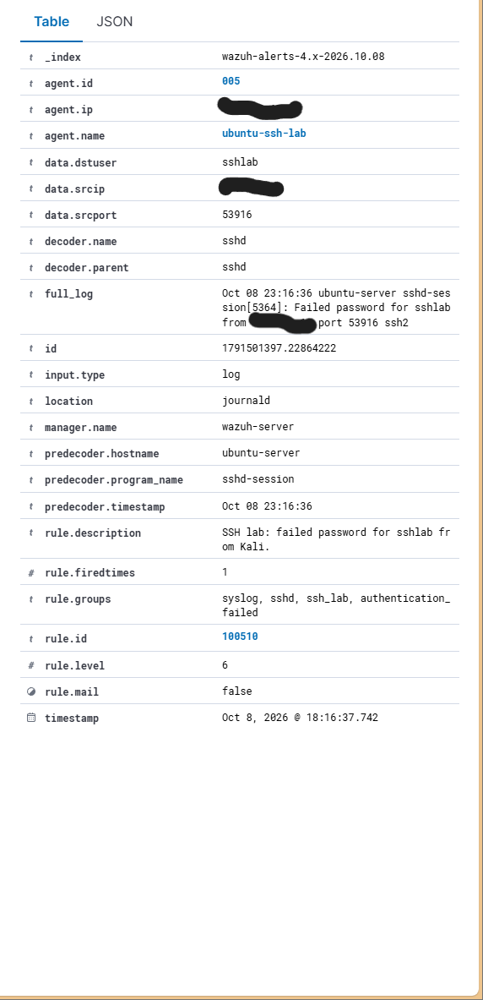
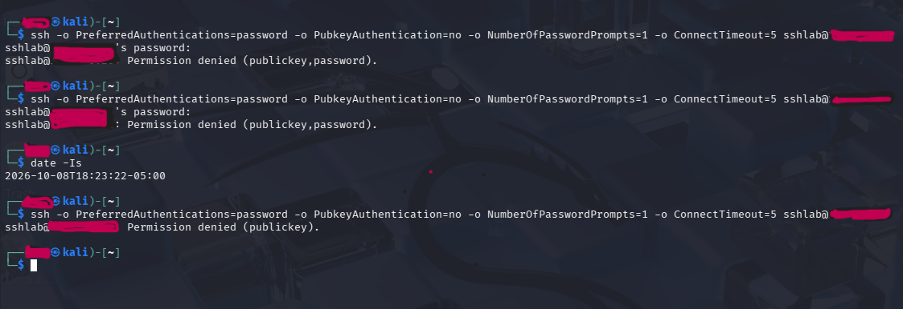

# Published SSH lab evidence

Two original screenshots were cropped and manually redacted, reviewed in the chat, and saved as PNG copies. Network addresses and the personal terminal username were covered. No generated or reconstructed screenshots are used.

## 1. Custom alert in Threat Hunting

Shows the dedicated sshlab account, sshd decoding, custom rule 100510 at level 6, and the alert timestamp. The dashboard displays local time (UTC−05:00); 18:16:37.742 corresponds to 23:16:37.742 UTC in the manager alert. The predecoder timestamp is the server log time.

## 2. Password authentication before and after hardening

Earlier attempts show password prompts and `Permission denied (publickey,password)`. After account-specific hardening, the same command shows `Permission denied (publickey)` without a password prompt. The client clock includes its UTC−05:00 offset.

## Scope

These two published images support the custom-alert and client-behavior claims. Other configuration checks, manager logs, administrator-access verification, and firewall cleanup were inspected during the session and are described in the project write-up, but their screenshots are not included here. No successful key login or brute-force correlation threshold was demonstrated.
