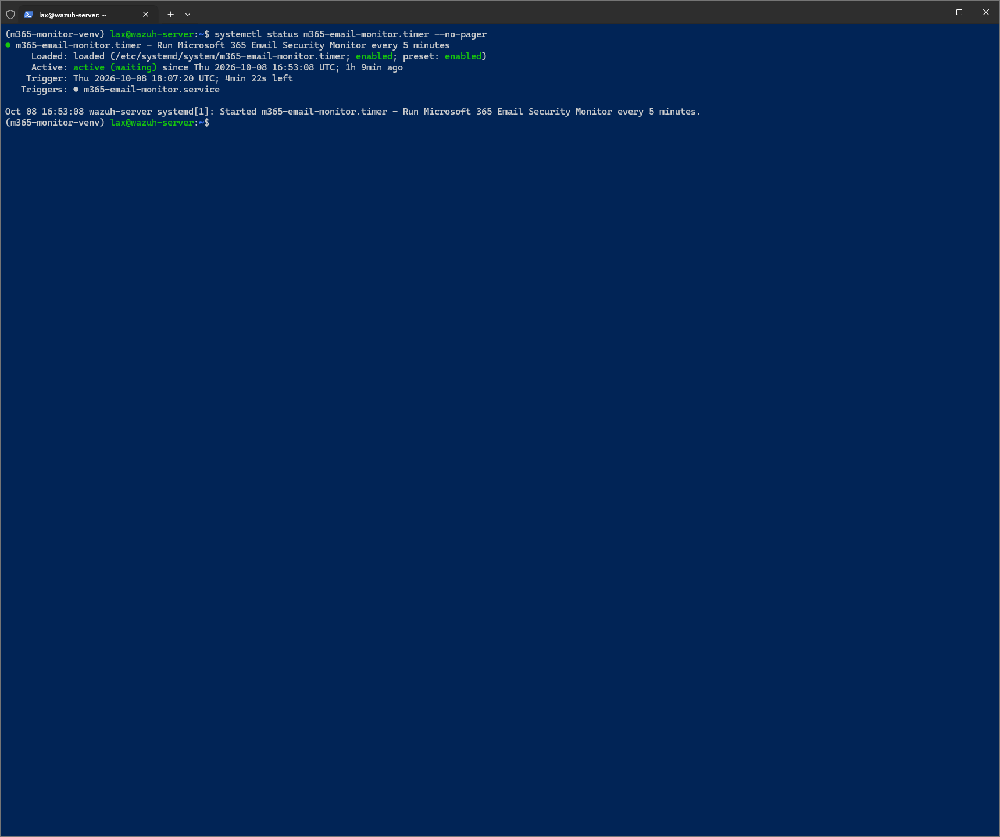
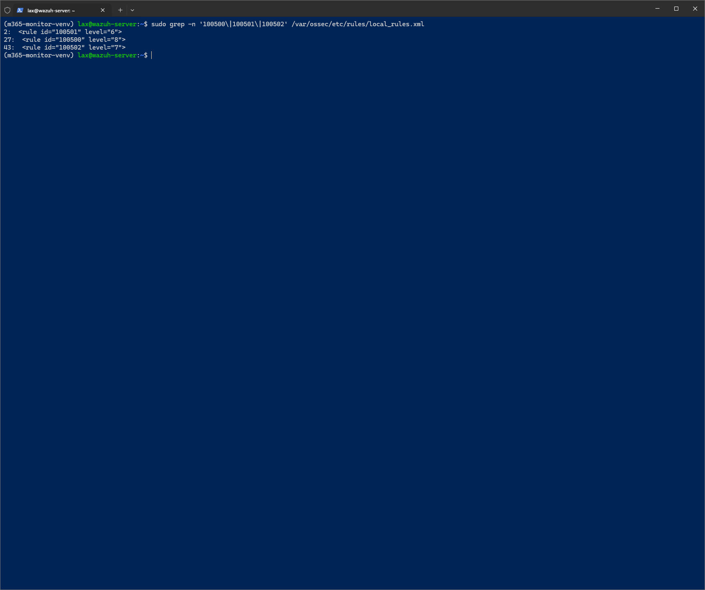
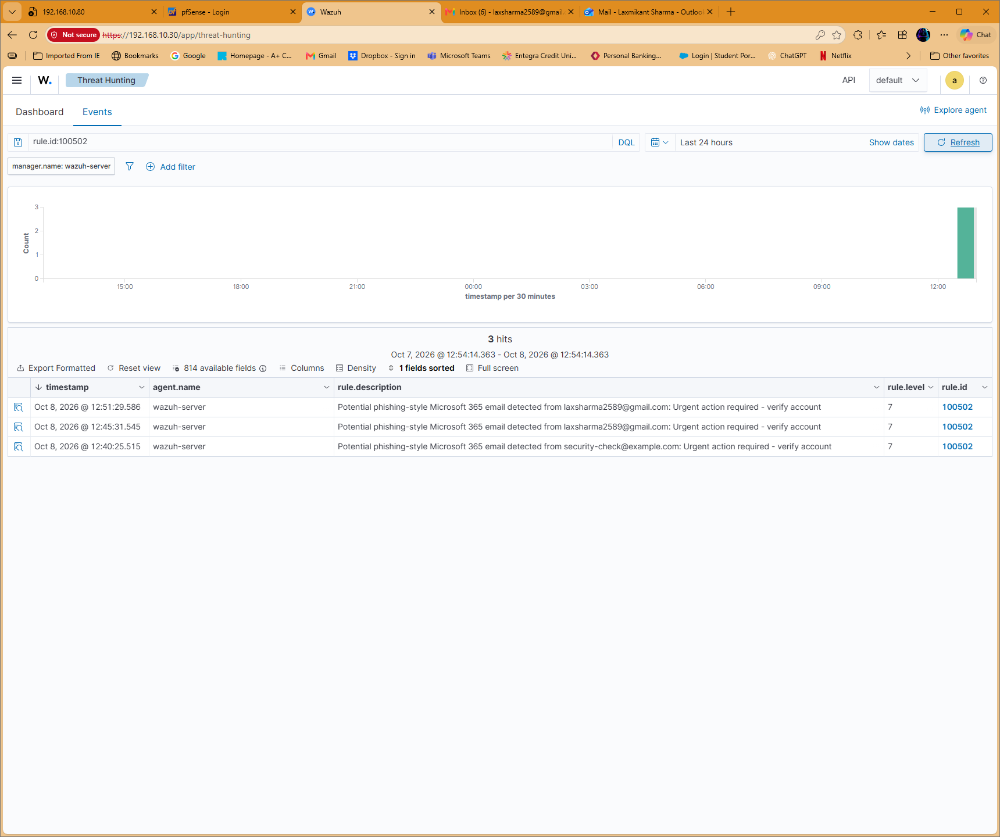

# Microsoft 365 Email Security Monitoring

Hands-on home-lab project connecting a **personal Outlook mailbox** to Microsoft Graph, a Python/MSAL monitor, and Wazuh. Completed and validated on October 8, 2026. The project title describes the email-monitoring workflow; this deployment used a personal Microsoft account rather than an enterprise Microsoft 365 tenant.

## Architecture

```text
Controlled Gmail test → Personal Outlook mailbox
                                  ↓
                 Microsoft Graph / delegated Mail.Read
                                  ↓
                 Python + MSAL / cached delegated login
                                  ↓
                 Message-ID deduplication → JSONL events
                                  ↓
                 Wazuh JSON log collection and decoding
                                  ↓
                 Rules 100500 / 100501 / 100502
                                  ↓
                 alerts.json → Wazuh Threat Hunting

systemd timer → monitor service every five minutes
```

The monitor collected email metadata, including subject, sender, received time, importance, and read status. Previously seen message IDs were tracked to avoid logging the same collected message on subsequent polls. MSAL reused cached tokens silently after an interactive delegated sign-in. Protected local configuration and cache files stayed on the lab host.

## Detection rules

| Rule | Level | Purpose | Validation recorded |
| --- | --- | --- | --- |
| 100500 | 8 | Microsoft account security notifications | Lab rule testing and alert verification |
| 100501 | 6 | High-importance email | Synthetic JSON event, live ingestion, and dashboard verification |
| 100502 | 7 | Phishing-style subject keywords | Rule test plus a real Gmail-to-Outlook test collected by the automated monitor |

Rule 100502 used case-insensitive subject matching for `verify account`, `password reset`, `urgent action`, `security alert`, `suspicious activity`, and `confirm your identity`.

These are triage heuristics. A matching subject or high importance does not establish maliciousness, and a Microsoft-looking sender is not proof of authenticity. This lab does not claim enterprise production operation, comprehensive phishing coverage, attachment scanning, or automatic remediation.

## Setup summary

1. Register an application supporting personal Microsoft accounts and public-client device-code authentication. Grant delegated Microsoft Graph `Mail.Read` access and complete consent for the monitored account. Keep the application/client ID local.
2. Create a Python virtual environment and install MSAL and an HTTP client. Configure the monitor to read mailbox messages through Graph using delegated access.
3. Complete initial device-code sign-in interactively, then use MSAL silent token acquisition for scheduled runs. If reauthentication is required, handle it interactively; avoid a timer job waiting indefinitely for input.
4. Keep configuration, token cache, deduplication state, and mailbox logs outside the repository with restrictive permissions. Emit one JSON object per new collected message into the JSONL log.
5. Configure Wazuh to collect the file as JSON. Install custom rules in `local_rules.xml`, validate with `wazuh-analysisd -t`, and restart the manager after validation passes.
6. Configure a systemd oneshot service and a five-minute timer; enable the timer and inspect its status and service journal.

The files in [examples/](examples/) are sanitized documentation examples, not exports of private host configuration. The original monitor, configuration, token cache, and deduplication database are deliberately excluded. Paths and service user names in the examples must be adapted locally. The rule example preserves the recorded 100500, 100501, and 100502 logic. Rule 100500 matched the Microsoft account-security notification sender field; it did not verify sender authenticity.

## Validation steps

```bash
systemctl status m365-email-monitor.timer --no-pager
systemctl is-enabled m365-email-monitor.timer
journalctl -u m365-email-monitor.service --since "10 minutes ago" --no-pager
sudo /var/ossec/bin/wazuh-analysisd -t
sudo /var/ossec/bin/wazuh-logtest
```

Use the synthetic records in [examples/test-events.jsonl](examples/test-events.jsonl) one at a time with `wazuh-logtest`. Expect 100501 at level 6 for the high-importance record and 100502 at level 7 for the keyword record. Do not treat synthetic injection as proof of Graph collection.

For an end-to-end test:

1. Send an authorized test email from a Gmail account you control to the monitored Outlook mailbox, with subject **Urgent action required - verify account** and a harmless lab-test body.
2. Confirm delivery, allow the next scheduled monitor run, and inspect the new JSONL event locally.
3. Confirm rule 100502 at level 7 in Wazuh alerts and search `rule.id:100502` in Threat Hunting. Check the sender, subject, receipt time, and source log to distinguish the real message from synthetic events.
4. Run the monitor again without sending another email; verify the previously collected message does not create a new JSONL record. Compare message IDs locally when distinguishing repeat processing from separately sent messages.
5. Remove temporary synthetic records from the lab source log after testing and confirm the timer remains active.

The recorded real test followed the full mailbox → Graph → monitor → JSONL → Wazuh → Threat Hunting path. The screenshot contains two real Gmail test alerts and an earlier synthetic alert; the project conversation confirms two separately sent emails. It is evidence of the real rule match, not a measured detection-rate or false-positive benchmark.

## Screenshots

### Active automation



### Custom rule IDs and levels



### Real email alert in Threat Hunting



These are the original supplied evidence screenshots. They show no client IDs, tokens, mailbox/message IDs, or token-cache contents. The Threat Hunting screenshot retains the test sender already used in the public portfolio contact details; the real event JSON and its message ID are not included.

## Security and practical limits

- Delegated read access, device-code authentication, and local token reuse were used; no client secret is required for the public-client pattern.
- Never commit client IDs, access/refresh tokens, device codes, mailbox IDs, real message IDs, cache contents, private config, or raw mailbox exports.
- Restrict the JSONL file to the monitor and required Wazuh collector access; review journal output to avoid dumping mailbox data.
- Five-minute polling introduces collection delay. Token expiry/revocation, Graph errors, pagination, retention, and polling gaps need operational handling before broader use.
- Message-ID deduplication addresses repeat polling in this lab. It does not claim exactly-once delivery across crashes or mailbox changes.

**Technologies:** Microsoft Graph, personal Outlook, Entra app registration, OAuth device-code flow, Python, MSAL, systemd, Linux, Wazuh, JSONL.

**Achievement:** Built and validated an automated Outlook → Microsoft Graph → Python/MSAL → Wazuh home-lab pipeline, with five-minute scheduling, message deduplication, three custom rules, and a real Gmail test alert verified in Threat Hunting.
